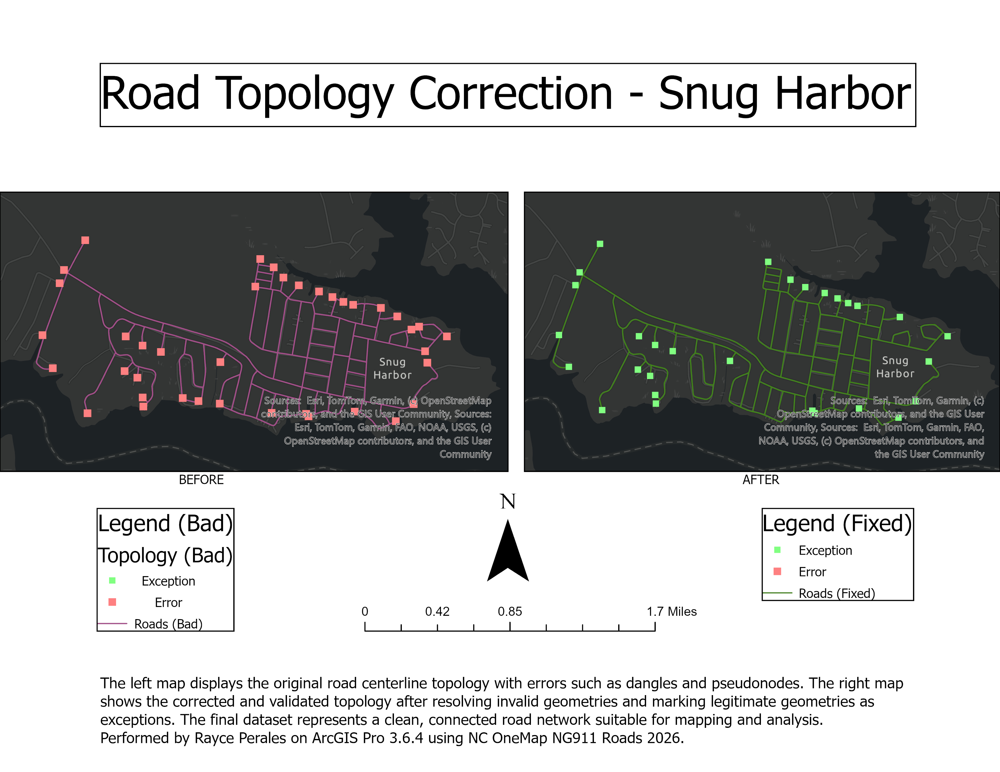
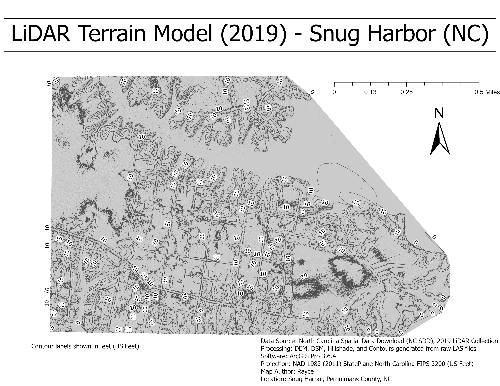

# GIS Portfolio – Rayce Perales
GIS Portfolio displaying knowledge, skill, capabilities and accomplishments; created by Rayce Perales.

---

## Project 1 – Building Footprint Digitization (Snug Harbor, NC)

**Tools:**  
ArcGIS Pro 3.6.4  

**Skills:**  
Digitizing, editing workflows, cartographic layout, metadata, coordinate systems  

**Overview:**  
This project demonstrates manual digitization of building footprints using high‑resolution Esri World Imagery. I selected a neighborhood in Snug Harbor, NC and created a new polygon feature class to capture all visible structures. Approximately 50 building footprints were digitized with clean geometry and attribute fields.

**Workflow:**

- Created a new file geodatabase and building footprint feature class  
- Set the coordinate system to NAD 1983 StatePlane North Carolina FIPS 3200 (US Feet)  
- Digitized each structure using polygon editing tools  
- Applied consistent symbology for clarity  
- Designed a professional map layout with legend, scale bar, north arrow, and metadata  
- Exported final outputs as Web JPEG (for display) and Vector PDF (for download)

**Download full map (PDF):**  
[Building Footprints – Snug Harbor, NC (Vector PDF)](building_footprint_digitalization_snugharbor.pdf)

---

## Project 2 – Road Topology Correction (Snug Harbor, NC)

**Tools:**  
ArcGIS Pro 3.6.4  

**Skills:**  
Topology validation, error correction, editing workflows, cartographic layout, geodatabase management  

**Overview:**  
This project demonstrates the identification and correction of topology errors within a road centerline dataset. The left map displays the original network containing dangles, pseudonodes, and improper intersections. The right map shows the corrected and validated topology after resolving invalid geometries and marking legitimate intersections as exceptions.

**Workflow:**

- Created a new file geodatabase and imported the road centerline dataset  
- Applied topology rules to identify dangles, pseudonodes, and improper intersections  
- Corrected invalid geometries using snapping, vertex editing, and feature modification tools  
- Marked legitimate intersections as exceptions to maintain accurate connectivity  
- Designed a dual‑map layout comparing original vs. corrected topology  
- Exported final outputs as Web JPEG (for display) and Vector PDF (for download)

**Download full map (PDF):**  
[Road Topology Correction – Snug Harbor, NC (Vector PDF)](road_topology_snugharbor.pdf)

---

## Project 3 – LiDAR‑Derived Terrain Visualization (Snug Harbor, NC)

**Tools:**  
ArcGIS Pro 3.6.4  

**Skills:**  
LiDAR processing, DEM generation, hillshade creation, contour extraction, raster analysis, cartographic layout  

**Overview:**  
This project uses 2019 North Carolina LiDAR data to generate a bare‑earth Digital Elevation Model (DEM), hillshade, and 2‑foot elevation contours for Snug Harbor, NC. The final map visualizes terrain variation in a coastal residential area using LiDAR‑derived elevation products.

**Workflow:**

- Downloaded 2019 LiDAR tiles from the NC Spatial Data Download (NC SDD) portal  
- Created a LAS Dataset and applied ground‑only classification filters  
- Generated a bare‑earth DEM using LAS Dataset to Raster  
- Created a hillshade using Spatial Analyst tools  
- Extracted 2‑foot contours and styled index contours for clarity  
- Designed a clean terrain visualization layout with title, scale bar, north arrow, and metadata  
- Exported final outputs as Web JPEG (for display) and Vector PDF (for download)

**Download full map (PDF):**  
[LiDAR‑Derived Terrain Visualization – Snug Harbor, NC (Vector PDF)](lidar_terrain_model_snugharbor.pdf)
