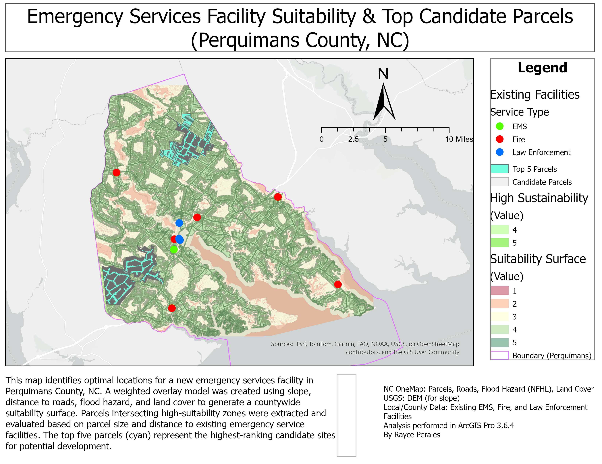
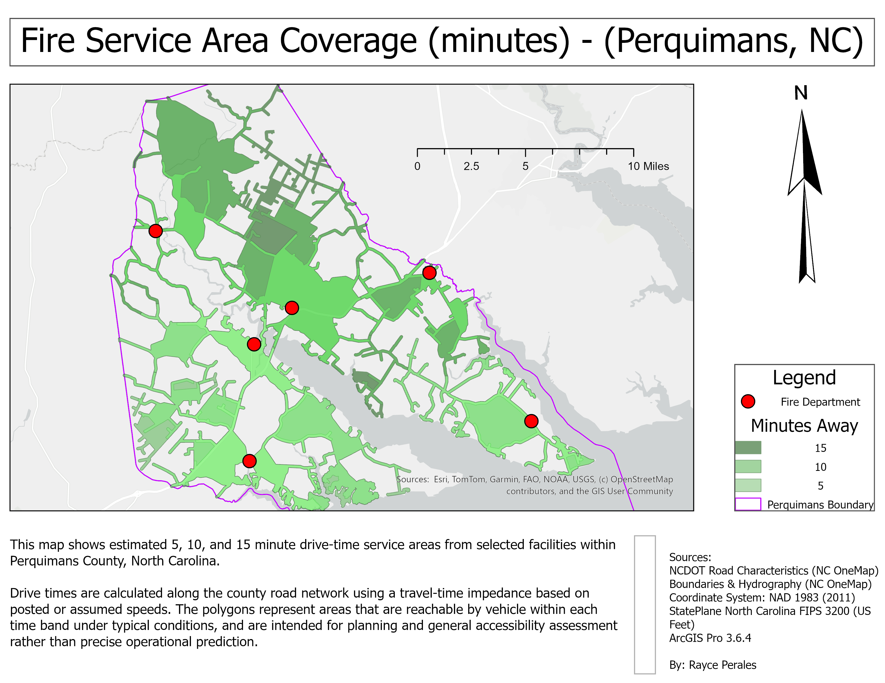
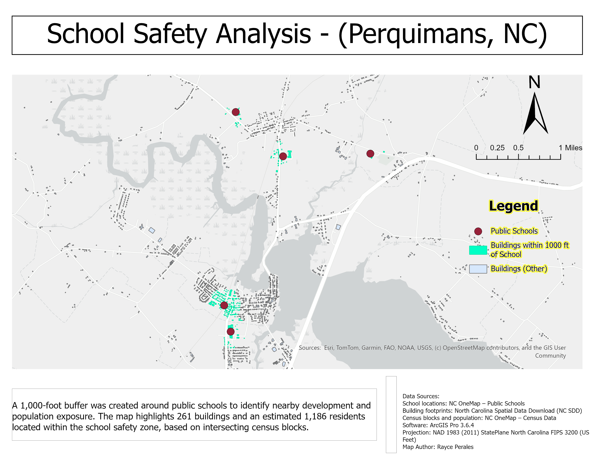

# GIS Portfolio – Rayce Perales
A collection of GIS projects demonstrating spatial analysis, emergency planning, LiDAR processing, network modeling, and cartographic design. I specialize in practical, data‑driven solutions using ArcGIS Pro and open geospatial data from NC OneMap and NCDOT. This portfolio highlights real‑world workflows, technical capability, and clear communication through professional map products.

---

## 🔧 Skills Summary

**Core Skills:**  
Spatial analysis • Network analysis • Raster modeling • LiDAR processing • Topology correction • Digitizing • Geoprocessing workflows • Cartographic layout • Data sourcing (NC OneMap, NCDOT)

**Tools & Technologies:**  
ArcGIS Pro 3.6.4 • Network Analyst • Spatial Analyst • LAS Dataset tools • File geodatabases • NC OneMap datasets

---

# 📌 **Project 1 – Emergency Services Facility Suitability (Perquimans County, NC)**

**Tools:**  
ArcGIS Pro 3.6.4  

**Skills:**  
Weighted overlay modeling, raster reclassification, distance analysis, parcel filtering, spatial decision support, cartographic layout  

**Overview:**  
Identified optimal locations for a new emergency services facility using a multi‑criteria suitability model integrating slope, roads, flood hazard, and land cover. High‑suitability parcels were ranked by size and proximity to existing EMS, fire, and law enforcement facilities.

**Workflow:**

- Downloaded DEM, roads, land cover, flood hazard, and parcels from NC OneMap  
- Generated slope raster and reclassified into suitability classes  
- Calculated Euclidean distance to roads and reclassified  
- Reclassified NFHL flood zones and NLCD land cover  
- Combined all rasters using a weighted overlay (Roads 40%, Slope 30%, Flood 20%, Land Cover 10%)  
- Extracted high‑suitability areas and intersected with county parcels  
- Calculated parcel area and distance to nearest emergency facility  
- Ranked parcels and highlighted the top five candidates  
- Designed a professional map layout and exported final products  

**Outcome:**  
Produced a ranked list of the top five parcels most suitable for a new emergency services facility, supporting long‑term planning and emergency response optimization.

**Download full map (PDF):**  
[Emergency Services Facility Suitability – Perquimans County, NC (Vector PDF)](emergency_services_suitability_perquimans.pdf)

---

# 📌 **Project 2 – Fire Service Area Coverage (Perquimans County, NC)**

**Tools:**  
ArcGIS Pro 3.6.4, Network Analyst  

**Skills:**  
Network dataset construction, travel‑time modeling, service area analysis, emergency response planning, cartographic layout  

**Overview:**  
Mapped 5, 10, and 15‑minute drive‑time service areas from fire service facilities using a travel‑time network built from NCDOT road centerlines. Results highlight areas with strong coverage and regions that may experience longer response times.

**Workflow:**

- Obtained NCDOT road centerlines and county boundary from NC OneMap  
- Built a travel‑time network dataset from road geometry and speed assumptions  
- Loaded fire service facilities as network analysis points  
- Generated 5, 10, and 15‑minute service area polygons with overlapping allowed  
- Styled polygons and facility points for clear interpretation  
- Designed a professional map layout with description and data source blocks  

**Data Sources:**  
NCDOT Road Centerlines (NC OneMap) • NC OneMap Boundaries & Hydrography • User‑provided facility locations (2026)

**Download full map (PDF):**  
[Fire Service Area Coverage – Perquimans County, NC (Vector PDF)](fire_service_area_coverage_perquimans.pdf)

---

# 📌 **Project 3 – School Safety Buffer & Population Impact Analysis (Perquimans County, NC)**

**Tools:**  
ArcGIS Pro 3.6.4  

**Skills:**  
Buffer analysis, spatial joins, census data integration, population estimation, cartographic layout  

**Overview:**  
Evaluated development and population exposure within 1,000 feet of public schools. Integrated building footprints and census block population data to quantify structures and residents inside the safety buffer.

**Workflow:**

- Downloaded school locations, building footprints, and census blocks from NC OneMap  
- Created a 1,000‑foot dissolved buffer around all public schools  
- Selected intersecting buildings and census blocks  
- Summarized total population and number of impacted structures  
- Designed a clear map layout showing schools, buffers, and affected areas  

**Outcome:**  
Identified **261 buildings** and approximately **1,186 residents** within the school safety buffer, supporting planning and public safety assessments.

**Download full map (PDF):**  
[School Safety Buffer & Population Impact Analysis – Perquimans County, NC (Vector PDF)](school_safety_analysis_perquimans.pdf)

---

# 📌 **Project 4 – LiDAR‑Derived Terrain Visualization (Snug Harbor, NC)**

**Tools:**  
ArcGIS Pro 3.6.4  

**Skills:**  
LiDAR processing, DEM generation, hillshade creation, contour extraction, raster analysis, cartographic layout  

**Overview:**  
Processed 2019 NC LiDAR data to create a bare‑earth DEM, hillshade, and 2‑foot contours for terrain visualization in a coastal residential area.

**Workflow:**

- Downloaded LiDAR tiles from NC Spatial Data Download  
- Created a LAS Dataset and filtered ground returns  
- Generated a bare‑earth DEM and hillshade  
- Extracted 2‑foot contours and styled index lines  
- Designed a clean terrain visualization layout  

**Download full map (PDF):**  
[LiDAR‑Derived Terrain Visualization – Snug Harbor, NC (Vector PDF)](lidar_terrain_model_snugharbor.pdf)

---

# 📌 **Project 5 – Road Topology Correction (Snug Harbor, NC)**

**Tools:**  
ArcGIS Pro 3.6.4  

**Skills:**  
Topology validation, error correction, editing workflows, geodatabase management, cartographic layout  

**Overview:**  
Identified and corrected topology errors in a road centerline dataset, including dangles, pseudonodes, and improper intersections.

**Workflow:**

- Imported road centerlines into a new geodatabase  
- Applied topology rules to detect errors  
- Corrected invalid geometries using snapping and vertex editing  
- Marked legitimate intersections as exceptions  
- Designed a dual‑map layout comparing original vs. corrected topology  

**Download full map (PDF):**  
[Road Topology Correction – Snug Harbor, NC (Vector PDF)](road_topology_snugharbor.pdf)

---

# 📌 **Project 6 – Building Footprint Digitization (Snug Harbor, NC)**

**Tools:**  
ArcGIS Pro 3.6.4  

**Skills:**  
Digitizing, editing workflows, cartographic layout, metadata, coordinate systems  

**Overview:**  
Digitized approximately 50 building footprints from high‑resolution imagery to create a clean, accurate structure dataset for a coastal neighborhood.

**Workflow:**

- Created a new file geodatabase and feature class  
- Set coordinate system to NAD 1983 StatePlane NC FIPS 3200 (US Feet)  
- Digitized structures using polygon editing tools  
- Applied consistent symbology and designed a professional layout  

**Download full map (PDF):**  
[Building Footprints – Snug Harbor, NC (Vector PDF)](building_footprint_digitalization_snugharbor.pdf)

---

**Last Updated:** May 2026  
